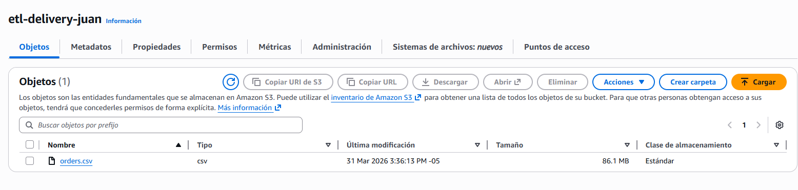
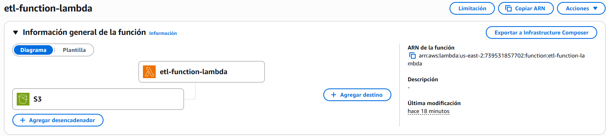
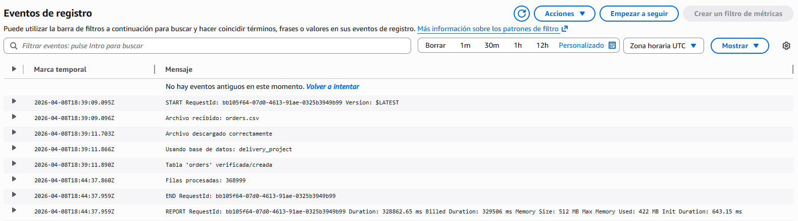
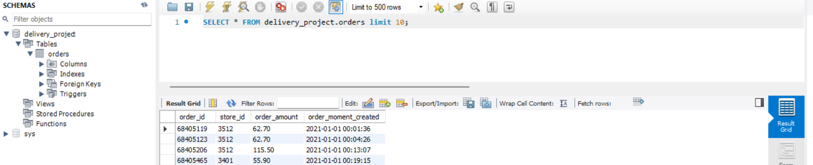
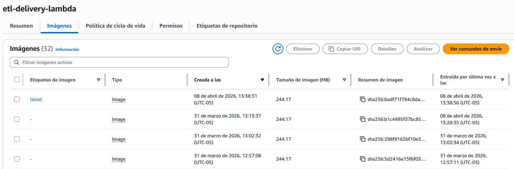

# AWS Serverless ETL Pipeline (S3 → Lambda → RDS MySQL)

This project implements a **serverless ETL (Extract, Transform, Load) pipeline** on AWS using modern data engineering practices. It automatically processes CSV files uploaded to Amazon S3, transforms the data, and loads it into a MySQL database hosted on Amazon RDS.

This project successfully processed **368,999 records** using a serverless ETL pipeline on AWS.

---

## Architecture Overview

The pipeline follows an event-driven architecture:

1. A CSV file is uploaded to **Amazon S3**
2. The event triggers an **AWS Lambda function (container-based)**
3. The Lambda image is stored and managed in **Amazon ECR**
4. The Lambda function:

   * Downloads the file
   * Parses and transforms the data
   * Loads it into **Amazon RDS (MySQL)**

---

## Tech Stack

* **AWS S3** – Data ingestion
* **AWS Lambda (Docker)** – Serverless compute
* **Amazon RDS (MySQL)** – Relational database
* **Amazon ECR (Elastic Container Registry)** – Docker image storage
* **Docker** – Containerized deployment
* **Python 3.11**
* **boto3** – AWS SDK
* **mysql-connector-python** – Database connection

---

## How It Works

### 1. Extract

* The Lambda function is triggered by an S3 event
* The CSV file is downloaded to a temporary directory

### 2. Transform

* Data is parsed using `csv.DictReader`
* Data cleaning:

  * Type casting (int, float)
  * Date parsing
  * Null handling

### 3. Load

* Data is inserted into MySQL using batch processing (`executemany`)
* Duplicate handling with:

```sql
ON DUPLICATE KEY UPDATE
```

---

## Database Schema

```sql
CREATE TABLE orders (
    order_id INT PRIMARY KEY,
    store_id INT,
    order_amount DECIMAL(10, 2),
    order_moment_created DATETIME
);
```

---

## Docker Setup

### Dockerfile

```dockerfile
FROM public.ecr.aws/lambda/python:3.11

COPY requirements.txt ${LAMBDA_TASK_ROOT}
RUN pip install -r requirements.txt --target "${LAMBDA_TASK_ROOT}"

COPY app.py ${LAMBDA_TASK_ROOT}

CMD ["app.lambda_handler"]
```

---

## Requirements

```txt
boto3
mysql-connector-python
```

---

## Deployment (AWS)

### 1. Build Docker Image

```bash
docker build -t etl-lambda .
```

---

### 2. Create ECR Repository

```bash
aws ecr create-repository --repository-name etl-lambda
```

---

### 3. Authenticate Docker to ECR

```bash
aws ecr get-login-password --region <region> \
| docker login --username AWS \
--password-stdin <aws_account_id>.dkr.ecr.<region>.amazonaws.com
```

---

### 4. Tag and Push Image

```bash
docker tag etl-lambda:latest <aws_account_id>.dkr.ecr.<region>.amazonaws.com/etl-lambda

docker push <aws_account_id>.dkr.ecr.<region>.amazonaws.com/etl-lambda
```

---

### 5. Create Lambda Function

* Type: **Container Image**
* Source: **Amazon ECR**
* Image URI: your ECR repository

Handler:

```
app.lambda_handler
```

---

### 6. Configure Environment Variables

| Variable    | Description       |
| ----------- | ----------------- |
| DB_HOST     | RDS endpoint      |
| DB_USER     | Database user     |
| DB_PASSWORD | Database password |
| DB_NAME     | Database name     |

---

### 7. Configure S3 Trigger

* Event type: `PUT`
* Bucket: your data bucket
* Optional filters: `.csv`


---

## Performance Considerations

* Batch inserts using `executemany()` for efficiency
* Idempotent loads using `ON DUPLICATE KEY UPDATE`
* Lightweight serverless architecture

---

## Testing & Evidence

#### 1. Success CSV file uploaded to S3


#### 2. Lambda execution logs (CloudWatch)



#### 3. inserted data in MySQL (RDS)


#### 4. Docker image stored in Amazon ECR


---

## 👨‍💻 Author

**Juan Esteban Franco**
Data Engineer | Backend Developer

---
